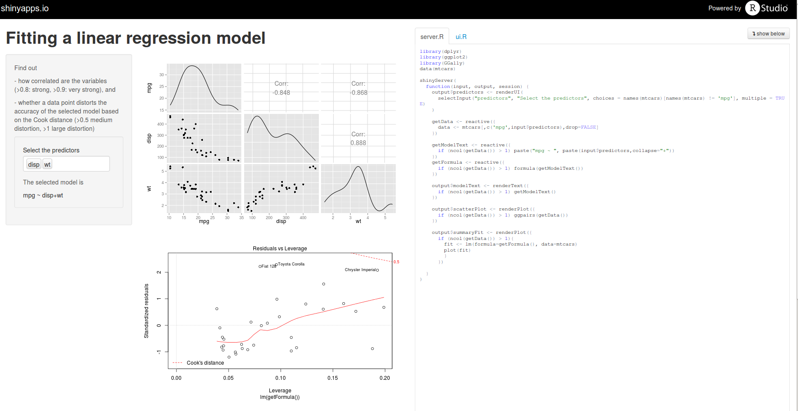
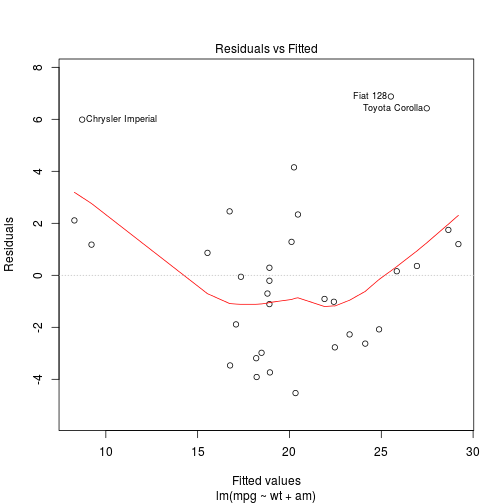
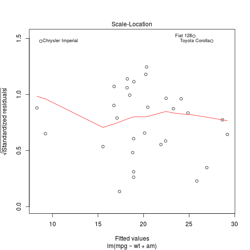
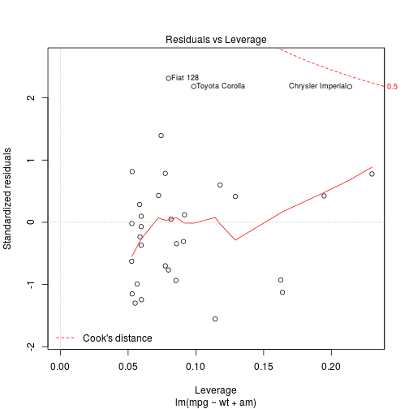

Fitting a linear regression model
========================================================
author: Jean-Baptiste Poullet
date: Feb 3rd, 2015 


Introduction
========================================================

The shiny app available on [shinyapps.io](https://poullet-coursera-developingdataproducts.shinyapps.io/poullet-coursera-developingDataProducts/) aims to quickly estimate a linear regression model on *mtcars* data. More specifically it shows    

- the correlation between variables,
- how a data point may distort the accuracy of the selected model (based on Cook's distance),
- how well the model fits the data based on the standardized residuals.

UI
========================================================
The shiny app looks like this 



Building the model
========================================================
The built model is a linear regression model without predictor interaction but with an intercept.
The model depends on the predictors selected by the user.

```r
data(mtcars)
# suppose the user selects wt and am as predictors,
# then we have the model fit
fit <- lm(mpg ~ wt + am, data=mtcars)
```

Example of residual vs fitted value plot
========================================================

```r
# the residual vs fitted value plot
plot(fit)
```

    


